# Ultra-Advanced Cloudflare Edge HTMLRewriter & Programmatic Google SEO Master Plan
## Mahindra Lifespaces Mahalunge & Pune Real Estate Ecosystem

**Target Domain:** `https://mahindralifespaceshomes.in`  
**Execution Runtime:** Cloudflare Pages Edge Runtime (`functions/_middleware.js` with V8 `HTMLRewriter`)  
**Static Generator:** Astro 3.5.0 SSG  
**Core Objective:** Absolute Google Rank #1 Dominance for Brand, Corridor, Proximity, Competitor Comparison, and Typology queries.

---

## ⚡ 1. Ultra-Advanced Cloudflare Edge HTMLRewriter Architecture

### Edge Middleware: [`functions/_middleware.js`](file:///Users/vikasyewle/Documents/mahindramahalunge/functions/_middleware.js)

Cloudflare Pages automatically invokes `functions/_middleware.js` on every incoming edge request. Using native V8 streaming `HTMLRewriter`, the edge node transforms HTML in flight at sub-millisecond speeds before delivering bytes to clients and search crawlers.

```
[ Incoming Request (User / Googlebot) ]
                 │
                 ▼
[ 1. Edge Canonicalizer & Trailing Slash Redirection ]
  - Checks if URL lacks trailing slash on non-file routes
  - Immediately issues 301 Permanent Redirect (0 origin load)
                 │
                 ▼
[ 2. Bot Classification & Crawl Intelligence ]
  - Regex detection for Googlebot, Bingbot, Social bots, AI crawlers
  - Sets X-Edge-Bot-Classification header
                 │
                 ▼
[ 3. Upstream Static Fetch (Cloudflare Edge Cache / KV) ]
                 │
                 ▼
[ 4. Native Edge HTMLRewriter Stream Transformation ]
  ├── <head> Rewriter:
  │     ├── Critical DNS Prefetch & Preconnect (Fonts, Unsplash CDN)
  │     ├── Real-time ISO Freshness Timestamps (og:updated_time, dc.date.modified)
  │     ├── Micro-Market Geo-Coordinates (Pune 411045, 18.5714;73.7432)
  │     └── Edge Schema Injection (WebSite with SearchAction & RealEstateAgent)
  └── Image / LCP Rewriter:
        └── Enforces fetchpriority="high", loading="eager", decoding="async"
                 │
                 ▼
[ 5. Edge Header Hardening & Stale-While-Revalidate ]
  - X-Robots-Tag: index, follow, max-image-preview:large
  - Cache-Control: public, max-age=3600, s-maxage=86400, stale-while-revalidate=604800
  - Output Streamed to Client in < 15ms TTFB
```

---

## 🎯 2. Programmatic Google SEO 5-Tier Content Architecture

Our programmatic engine scales content across 5 distinct intent tiers without duplicate content penalties:

```mermaid
graph TD
  Root["mahindralifespaceshomes.in"] --> T1["Tier 1: Tech Park Proximity (/near/)"]
  Root --> T2["Tier 2: Competitor Comparisons (/compare/)"]
  Root --> T3["Tier 3: Transit Corridors (/connectivity/)"]
  Root --> T4["Tier 4: Pune Portfolio Deep-Dives (/brand/)"]
  Root --> T5["Tier 5: Configurations & Typologies (/residences/)"]

  T1 --> T1_1["Infosys Hinjewadi (7 mins)"]
  T1 --> T1_2["Wipro Circle (6 mins)"]
  T1 --> T1_3["TCS Sahyadri Park (12 mins)"]
  T1 --> T1_4["Balewadi High Street (8 mins)"]

  T2 --> T2_1["vs Godrej Hillside"]
  T2 --> T2_2["vs VTP Blue Waters"]
  T2 --> T2_3["vs Kolte Patil Life Republic"]
  T2 --> T2_4["vs Lodha Panache"]

  T3 --> T3_1["Pune Metro Line 3"]
  T3 --> T3_2["PMRDA 36m Ring Road"]
  T3 --> T3_3["Mahalunge River Bridge"]

  T4 --> T4_1["Mahindra IvyLush (Kharadi)"]
  T4 --> T4_2["Mahindra Citadel (Pimpri)"]
  T4 --> T4_3["Mahindra Happinest Tathawade"]

  T5 --> T5_1["2 BHK Optima Suites"]
  T5 --> T5_2["3 BHK Luxe Residences"]
  T5 --> T5_3["4 BHK Signature Estates"]
```



### Tier 1: Tech Park Proximity & Commute Clusters (`/near/[slug]/`)
* **Current Deployed:** 8 Pages
* **Planned Expansion:** 16 Pages
* **Formula:** `Flats near [Tech Park / Employer Name] + Commute Matrix + Mahindra Mahalunge`
* **Target Hubs:**
  1. `/near/flats-near-infosys-hinjewadi/` (3.4 km / 7 mins)
  2. `/near/flats-near-wipro-circle-hinjewadi/` (3.1 km / 6 mins)
  3. `/near/flats-near-tcs-sahyadri-park-hinjewadi/` (6.8 km / 12 mins)
  4. `/near/flats-near-embassy-techzone-hinjewadi/` (4.5 km / 9 mins)
  5. `/near/flats-near-cognizant-hinjewadi/` (3.8 km / 8 mins)
  6. `/near/flats-near-quadron-business-park-hinjewadi/` (4.9 km / 10 mins)
  7. `/near/flats-near-balewadi-high-street/` (4.6 km / 8 mins)
  8. `/near/flats-near-amar-paradigm-baner/` (5.2 km / 10 mins)
* **Expansion Pipeline:**
  9. `/near/flats-near-eon-it-park-kharadi/` (Connecting IvyLush)
  10. `/near/flats-near-wtc-pune/` (Connecting IvyLush)
  11. `/near/flats-near-sant-tukaram-metro-pimpri/` (Connecting Citadel)
  12. `/near/flats-near-tata-motors-pimpri/`
  13. `/near/flats-near-bavdhan-tech-center/`
  14. `/near/flats-near-wakad-it-corridor/`

---

### Tier 2: Project & Developer Head-to-Head Comparisons (`/compare/[slug]/`)
* **Current Deployed:** 6 Pages
* **Planned Expansion:** 14 Pages
* **Formula:** `Mahindra Mahalunge vs [Competitor Development] + 8-Point Scorecard + Density Comparison`
* **Target Comparisons:**
  1. `/compare/mahindra-mahalunge-vs-godrej-hillside/`
  2. `/compare/mahindra-mahalunge-vs-vtp-blue-waters/`
  3. `/compare/mahindra-mahalunge-vs-kolte-patil-life-republic/`
  4. `/compare/mahindra-mahalunge-vs-lodha-panache-hinjewadi/`
  5. `/compare/mahalunge-vs-baner-real-estate/`
  6. `/compare/mahalunge-vs-wakad-real-estate/`
* **Expansion Pipeline:**
  7. `/compare/mahindra-ivylush-vs-godrej-infinity-keshavnagar/`
  8. `/compare/mahindra-citadel-vs-runwal-elixir-pimpri/`
  9. `/compare/mahindra-happinest-vs-rohan-ananta-tathawade/`
  10. `/compare/mahindra-mahalunge-vs-megapolis-hinjewadi/`
  11. `/compare/mahindra-mahalunge-vs-shapoorji-pallonji-sensorium/`

---

### Tier 3: Strategic Civic Infrastructure Corridors (`/connectivity/[slug]/`)
* **Current Deployed:** 3 Pages
* **Planned Expansion:** 8 Pages
* **Formula:** `Properties near [Civic Infrastructure Route] + PMRDA DP Road + Transit Transformation`
* **Target Corridors:**
  1. `/connectivity/flats-near-pune-metro-line-3-hinjewadi/`
  2. `/connectivity/properties-on-pmrda-36m-ring-road/`
  3. `/connectivity/mahalunge-hinjewadi-river-bridge-connectivity/`
* **Expansion Pipeline:**
  4. `/connectivity/properties-near-pune-ring-road-western-alignment/`
  5. `/connectivity/flats-near-mumbai-pune-expressway-access-point/`
  6. `/connectivity/flats-near-balewadi-stadium-metro-station/`

---

### Tier 4: Pune Mahindra Portfolio Authority Deep-Dives
* **Current Deployed:** Unified Brand Hub (`/brand/`) with 9 projects
* **Planned Expansion:** Dedicated sub-hubs for each major development:
  1. `Mahindra Mahalunge (13.46-Acre Flagship Pre-Launch)`
  2. `Mahindra IvyLush (Kharadi Annex / Wagholi — 5.4 Acres)`
  3. `Mahindra Citadel (Pimpri Metro — 9.66 Acres)`
  4. `Mahindra Happinest Tathawade (Phase 1–4 Fusion Homes)`
  5. `Mahindra Antheia (16-Acre Delivered Community with OC)`
  6. `Mahindra Centralis (Delivered High-Rise Enclave)`
  7. `Mahindra Nestalgia (Biophilic Heritage Homes)`
  8. `Mahindra L'Artista (Ultra-Luxury Sopan Baug / Ghorpadi)`
  9. `Mahindra Woods (Pimpri Heritage)`

---

### Tier 5: Configurations, Typology & Budget Lead Magnets (`/residences/`)
* **Current Deployed:** 3 Curated Pages (`/residences/2-bhk/`, `/residences/3-bhk/`, `/residences/4-bhk/`)
* **Lead Ingestion:** Interactive modal with dynamic interest tracking and confidential cost sheet generation.

---

## 🚀 3. Crawl Budget, Internal Linking & Sitemaps Execution

### 1. Zero-Orphan Architecture
* **Global Footer Directory:** A 4-column crawl pathway embedded across all 38 pages, passing internal PageRank to every programmatic cluster.
* **Programmatic Hub Directory:** Central index component rendered on the homepage and articles hub.

### 2. Strict Trailing Slash Canonicalization
* Normalized across `astro.config.mjs`, `public/sitemap.xml`, `<link rel="canonical">`, and enforced at the edge via `functions/_middleware.js` (301 redirect).

### 3. Googlebot Real-Time Freshness Trigger
* Every crawl request to `functions/_middleware.js` automatically stamps the dynamic ISO header and meta timestamp (`og:updated_time`, `dc.date.modified`), signaling to Google that the content is actively updated and indexed.
